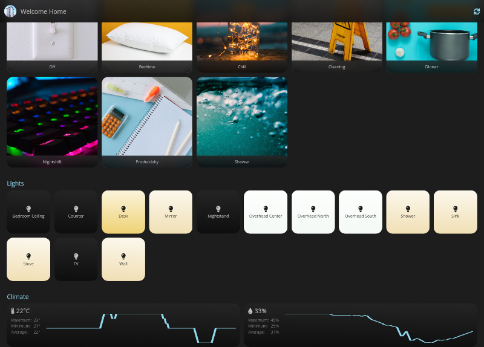

# The frick's this?
A control cardl for my "smart" home. (Bascically a glorified light switch...)
It controls IKEA Trådfri lights and shows the current weather using wttr.in, just in case there's no window around.

The API is based on express.js, the frontend is vue.js

# Build and Run
* `npm run install_all` runs `npm install` for both the frontend and the server
* `npm run build_frontend` transpiles the vue frontend and copies the output to the server's static file location
* `npm run start_server` starts the express server that handles api requests and serves the frontend
* Application starts on the port defined in `/server/src/config.js`